# 索引头文件建议

针对 cbe 游戏开发引擎，给出以下建议。

提供一个面向前端开发者的，可编辑的，直接作用于生产环境的前端开发文件入口。

## 代码架构建议

## user-main.js 提案，文件导入

提供一个固定目录的，固定文件名。或者在引擎内配置一个 js 文件导入入口。以便于项目打包时能够识别，导入开发者自己写的 js 文件。cbe 引擎只管导入文件，不管其他内容。

这样设计是因为可以最大化的释放 js 开发者的潜力，对于 js 开发者，可以自行实现：

1. 自己搭建一个简易的 node 项目。
2. 可以自由地使用自己喜欢的前端构建工具，反正 node 项目都是自己搭建的，webpack、rollup、vite、swc、turbopack 均可。
3. js 开发者只考虑最终产物要提供一个类似于 user-main.js 的文件给 cbe 引擎即可。
4. 打包器只支持 esm 语法。user-main.js 将使用 esm 导入其他 js 文件，而 cbe 引擎将不会过问 user-main.js 自己另外导入的 js 模块。

## cbe.d.ts 提案，引擎类型声明文件

cbe 引擎要在工程内提供类型声明文件，以便 js 开发者直接使用暴露在全局 window 对象的函数与变量。

## 直接使用 window 对象提供的函数与对象

为了降低开发难度，我推荐 js 和 bs 之间尽量不做任何相互调用。如果 js 可以直接调用 bs 提供的模块，那自然是最好的。

如果实现有难度，我推荐 js 直接调用来自 window 对象提供的函数和变量，间接地使用 bs 提供的模块。
