# 手动控制的异步任务行为

## 遇到的问题

异步任务会控制一个`loading`变量，这个变量会给页面增加加载等待效果。这有一个缺点，当用户经常在下拉框内切换选择内容时，会频繁请求接口，且当接口请求用时非常短时，交互效果不太好。就变成了，每当用户选择一次内容时，页面就突然白屏地闪一下。起因就是`loading`变量在短时间内频繁的变更赋值。

当接口请求时间较长时，`loading`变量切换的时间周期也会较长。用户有着较好的体验，有加载等待效果。

当接口请求时间较短时，`loading`变量会快速的切换。用户的体验反而下降了，用户看不到加载等待效果，而是屏幕闪屏。

## 尝试的解决方案

新增一个异步任务，让`loading`变量等待一定的毫秒后，再开始变化。并不会随着接口的请求而立刻更新值。

- 先无条件执行定时器，让`loading`变量稍后做变更。
- 执行后端接口请求。
- 无论接口请求是否成功，完成长短与否，都清空定时器，关闭`loading`变量。

### 情况 1-接口请求时间较长

`loading`变量总是在稍后执行，并且会随着异步请求的完成而同时关闭，同时完成。

界面效果是，用户点击选择框，稍后才提供加载等待效果。

流程图如下：



```mermaid
gantt
  title 优化的异步loading写法
  dateFormat SSS
  axisFormat %L

  section 任务
  主异步任务 :active, 000, 500
  loading加载任务 :active, 300, 500
```

### 情况 2-接口请求时间很短

计时器还没开始，就被清空结束了。`loading`变量甚至没有机会做设置。

界面效果是，用户点击选择框，根本不提供任何加载等待效果。

流程图如下：



```mermaid
gantt
  title 优化的异步loading写法
  dateFormat SSS
  axisFormat %L

  section 任务
  主异步任务 :active, 000, 080
```

## 代码

```js
async (currentRenderConf = {}) => {
	const delay = 300;
	let timer = setTimeout(() => {
		currentRenderConf.innerLoading = true;
	}, delay);

	// 从form表单内获取id值，由形参做解构赋值
	await this.setAddress(this.form);

	clearTimeout(timer);
	currentRenderConf.innerLoading = false;
};
```
