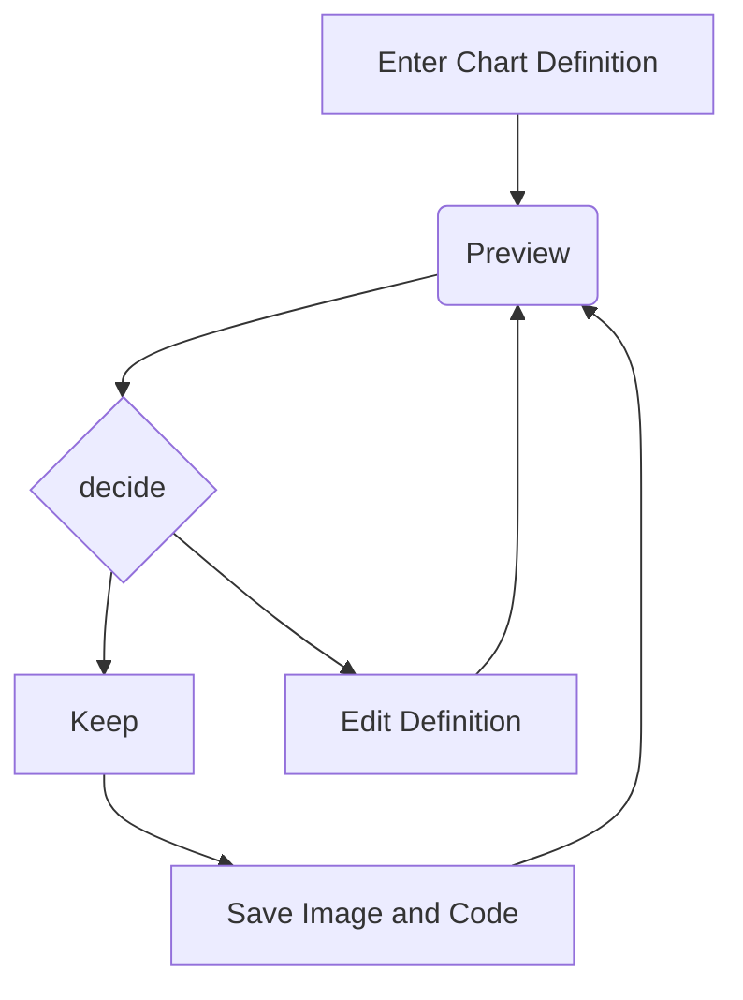
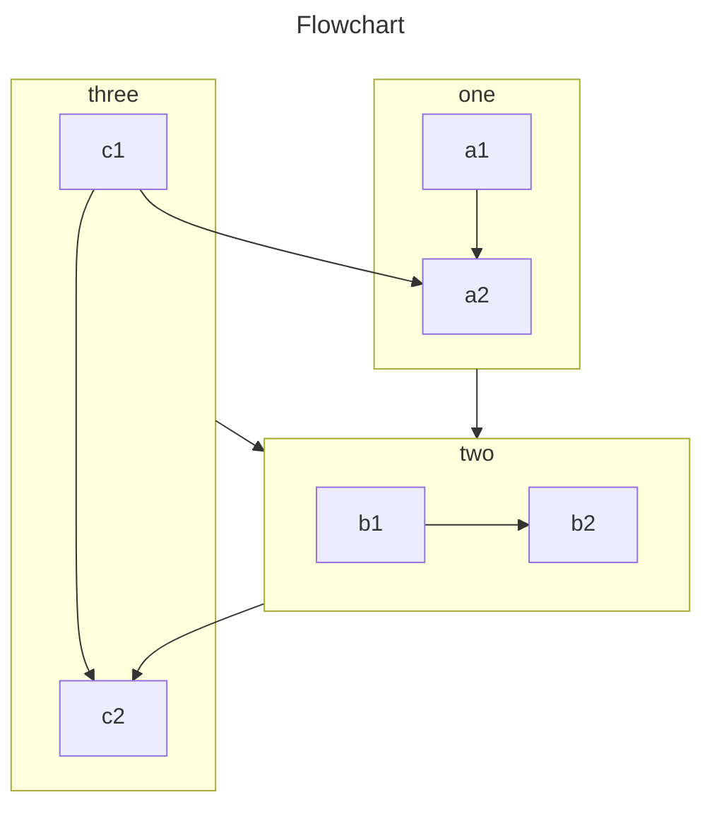

# 用 amondnet/vercel-action 完成部署

学着使用 [amondnet/vercel-action](https://github.com/marketplace/actions/vercel-action) 实现简单的部署。

## 项目

目前用钻头的小爱丽丝官网来做测试。

## 第一次尝试

发现效果不太好。我应该尽量避免自己在 linux 端上用 vercel cli 来部署项目。

```yaml
# 参考资料
# https://vercel.com/guides/how-can-i-use-github-actions-with-vercel
# https://vercel.com/guides/how-to-alias-a-preview-deployment-using-the-cli

name: Vercel Preview Deployment
env:
  VERCEL_ORG_ID: ${{ secrets.VERCEL_ORG_ID }}
  VERCEL_PROJECT_ID: ${{ secrets.VERCEL_PROJECT_ID }}
on:
  push:
    branches:
      - dev
jobs:
  install:
    runs-on: ubuntu-latest
    steps:
      - uses: pnpm/action-setup@v2
        with:
          version: 8.14.0

  Deploy-Preview:
    runs-on: ubuntu-latest
    steps:
      - uses: actions/checkout@v2
      - name: Install Vercel CLI
        run: npm install --global vercel@latest pnpm@8.14.0
      - name: Pull Vercel Environment Information
        run: vercel pull --yes --environment=preview --token=${{ secrets.VERCEL_TOKEN }}
      - name: Build Project Artifacts
        run: vercel build --token=${{ secrets.VERCEL_TOKEN }}
      - name: Deploy Project Artifacts to Vercel
        run: vercel deploy --prebuilt --token=${{ secrets.VERCEL_TOKEN }} && vercel alias set dev-test ruan-cat.com
```

## 第二次尝试

```yaml
# 参考资料
# https://github.com/marketplace/actions/vercel-action
# https://vercel.com/guides/how-can-i-use-github-actions-with-vercel

name: Vercel Preview Deployment
env:
  VERCEL_ORG_ID: ${{ secrets.VERCEL_ORG_ID }}
  VERCEL_PROJECT_ID: ${{ secrets.VERCEL_PROJECT_ID }}
on:
  push:
    branches-ignore:
      - main
jobs:
  deploy:
    runs-on: ubuntu-latest
    steps:
      - uses: actions/checkout@v2
      - uses: amondnet/vercel-action@v19
        with:
          vercel-token: ${{ secrets.VERCEL_TOKEN }} # Required
          vercel-org-id: ${{ secrets.ORG_ID}} #Required
          vercel-project-id: ${{ secrets.PROJECT_ID}} #Required
          alias-domains: dev-test.ruan-cat.com
```

### 结论

用现成的 `amondnet/vercel-action@v19` 确实可以了。不过需要让 `dev-test.ruan-cat.com` 配置 DNS，配置来自 vercel 提供的 cname 才行。略有被动。

## 在 monorepo 内部署项目

上面的可以了，可以在 dev 分支内部署了。但是我不清楚在 monorepo 内实现多项目的部署。

### `vercel-action` 的 `working-directory` 配置

- https://github.com/marketplace/actions/vercel-action#inputs

工作流的配置可以考虑配置路径地址，让多个不同的物理地址映射到多个不同的 url。

经过实验得知，该配置其实是工作目录。是配置 vercel cli 运行的根目录，和映射 url 没关系。

### `vercel.json` 的 `outputDirectory` 配置

- https://vercel.com/docs/projects/project-configuration#outputdirectory

在配置文件内指定部署的目录。但是发现这个配置只能去指定一个物理地址，不能指定更多的地址。

### 单一 git 存储库连接多个 vercel 项目

阅读了多篇 vercel 官方文档，注意到其 monorepo 的实现方式是，单一 git 存储库连接多个 vercel 项目。这个做法和我的期望不太相符，我不太希望创建多个 vercel 项目。维护麻烦。

另外，根据此[官方文章](https://vercel.com/docs/limits/overview#general-limits)得知，一个单一 git 存储库最多只能连接 3 个 vercel 项目，这个数据量太小了。

其他的 issue 也抱怨这个限制：

- https://github.com/amondnet/vercel-action/issues/103#issuecomment-917137742

## 阶段性总结

- 熟悉了 amondnet/vercel-action 工作流的使用
- 用自定义子域名，实现了 monorepo 项目的多网站部署

## 上述方案的缺陷

无法实现有效的 monorepo 任务调度。

首先 github action 的配置文件太多了，即使我们更改成串行的配置，也无法解决 monorepo 的任务调度问题。

```yaml
name: 批量部署vercel项目
on:
  push:
    branches:
      - dev

jobs:
  deploy:
    runs-on: ubuntu-latest
    steps:
      - name: 检出项目
        uses: actions/checkout@main

      - name: 部署monorepo-4
        uses: amondnet/vercel-action@v25.1.1
        with:
          vercel-token: ${{ secrets.vercel_token }}
          vercel-org-id: ${{ secrets.vercel_orgId}}
          vercel-project-id: ${{ secrets.vercel_projectId}}
          vercel-args: "--prod --cwd ./ --local-config ./packages/monorepo-4/vercel.json"
          vercel-version: 34.1.2
          alias-domains: monorepo-4.ruancat6312.top

      - name: 部署monorepo-5
        uses: amondnet/vercel-action@v25.1.1
        with:
          vercel-token: ${{ secrets.vercel_token }}
          vercel-org-id: ${{ secrets.vercel_orgId}}
          vercel-project-id: ${{ secrets.vercel_projectId}}
          vercel-args: "--prod --cwd ./ --local-config ./packages/monorepo-5/vercel.json"
          vercel-version: 34.1.2
          alias-domains: monorepo-5.ruancat6312.top
```

### 重复打包子依赖

打包每一个网站时，都要先打包 monorepo 的子依赖，才能打包网站，这样效率很低。会出现重复打包的情况。

而且需要我们手动地做好任务调度，先打包子依赖，再打包网站。





```sequence Greetings
Alice ->> Bob: Hello Bob, how are you?
Bob-->>John: How about you John?
Bob--x Alice: I am good thanks!
Bob-x John: I am good thanks!
Note right of John: Bob thinks a long<br/>long time, so long<br/>that the text does<br/>not fit on a row.

Bob-->Alice: Checking with John...
Alice->John: Yes... John, how are you?
```

### 打包产物不在同一个目录下

上述的工作流，实际上会在 vercel 平台内，启动两个服务器来运行，而不是同一个机器内运行的。

这导致很多打包好的文件是不能共用的。
