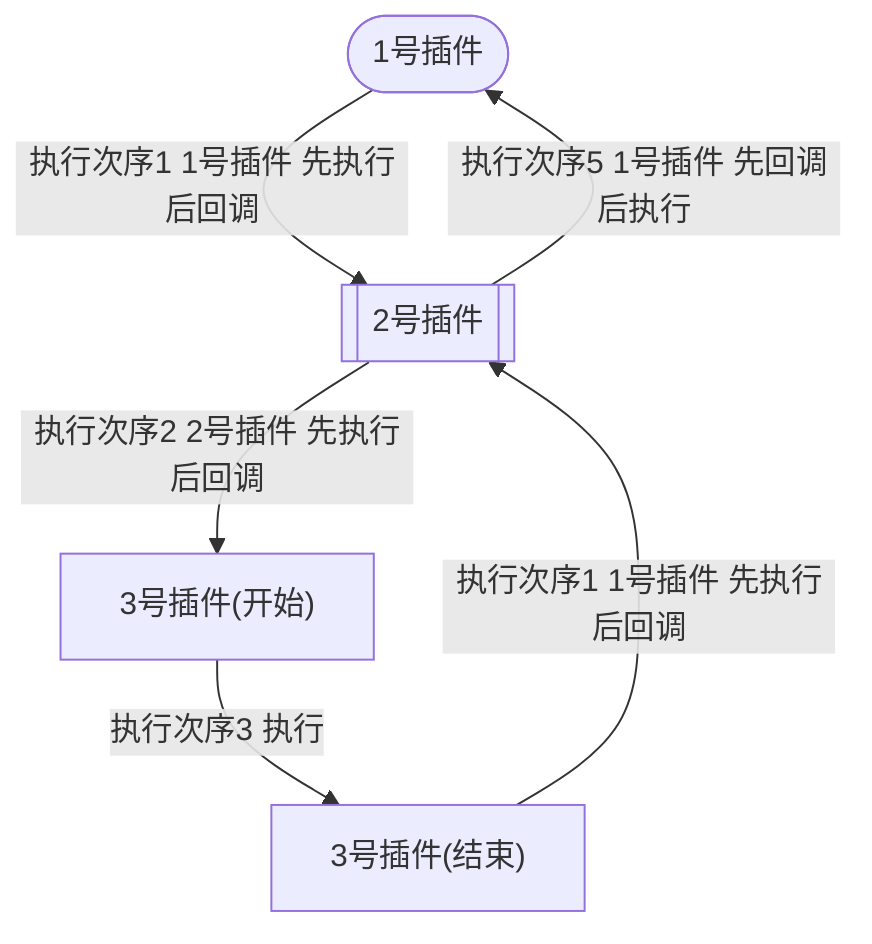

# 阮中楠自己的一些 vue 开发笔记

这些内容只是阮中楠自己临时存放 vue 笔记的地方，大部分与 rpgmv 开发无关。

## 前端学习待办：

FileSaver

## vue-class-component

https://github.com/fmfe/vue-class-setup

https://github.com/vuejs/vue-class-component

感觉现在写 vue 组件的方式很多。需要搞清楚这些是什么东西。

## 测试性质的流程图

```mermaid
gantt
  title 优化的异步loading写法
  dateFormat SSS
  axisFormat %L

  section 任务
  主异步任务 :active, 000, 500
  loading加载任务 :active, 300, 500
```

## vue3 的 ref 函数

韦景堂称 ref 函数可以有效的，优雅的实现异步数据获取与页面组件渲染之间的关联问题。

我目前没有学到更好的解决方案，不知道蔡德东有没有更加优雅合适的方案：
1： 简单粗暴的方式
必须等待异步数据到了以后，才开始做组件渲染。直接 v-if 或者是 key 来控制组件渲染。
2： 麻烦但是交互较好的方式
watch 或者是 compute 数据。监听数据变化，只要变化了，就更新变量并实现数据的响应式渲染。

韦景堂称该 ref 函数可以克服上述方案的困境。有待尝试。
