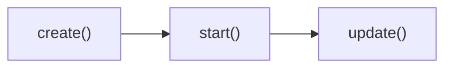

# 场景类所需的基本函数

一个场景至少需要增加`create()`、`start()`、和`update()`方法，这三个方法是`SceneManager`场景管理对象所要求必须实现的方法。

用生命周期的概念来理解，可以认为上述方法依次执行，如下图：



## create()

`SceneManager.changeScene`方法管理了场景的切换。如果一个场景不提供`create`方法时，则很容易出错。这个方法用于实现基本场景切换，场景切换前，必须要先构建场景。

```js {11}
SceneManager.changeScene = function () {
  if (this.isSceneChanging() && !this.isCurrentSceneBusy()) {
    if (this._scene) {
      this._scene.terminate();
      this._scene.detachReservation();
      this._previousClass = this._scene.constructor;
    }
    this._scene = this._nextScene;
    if (this._scene) {
      this._scene.attachReservation();
      this._scene.create();
      this._nextScene = null;
      this._sceneStarted = false;
      this.onSceneCreate();
    }
    if (this._exiting) {
      this.terminate();
    }
  }
};
```

## start() & update()

`SceneManager.updateScene`方法要求每一个`_scene`需要提供`start`方法和`update`方法。

```js {4,9}
SceneManager.updateScene = function () {
  if (this._scene) {
    if (!this._sceneStarted && this._scene.isReady()) {
      this._scene.start();
      this._sceneStarted = true;
      this.onSceneStart();
    }
    if (this.isCurrentSceneStarted()) {
      this._scene.update();
    }
  }
};
```
